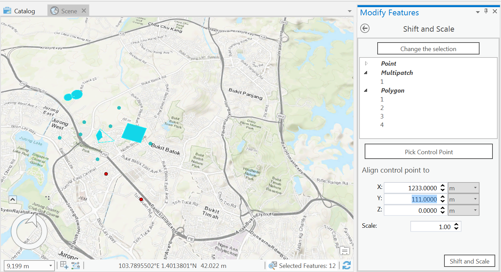

# README

This is an add-in for ArcGIS Pro desktop version 2.0 built with its SDK version 2.0.

It adds in a new option in the Modify pane called "Shift and Scale" that allows the user to select a set of features based on geometry filtering and move them to the desired coordinates: scaling is possible at the same time. 

## HOW TO USE

1. The user applies spatial filter using a rectangle geometry. Features contained in the geometry are then displayed as TreeView.
2. The user clicks on the map to choose a "control point". This is a point that will serve as a center point for the collection of features selected in step 1.
3. The user enters the X, Y and Z coordinates of the desired location for the selected features, as well as the new scale (default is 1). The add-in will then calculate the difference vector (controlPoint - desiredPoint) which will be used for the shifting of selected features.

